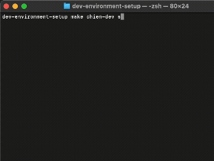

# chien-dev (dev-environment-setup)

<p align="center">
  
  
  
  
</p>

[English](./README.md) | [繁體中文](./README.zh-TW.md)

**chien-dev** is a standardized development environment scaffolder. It supports both **DevContainer** (Docker) and **Virtual Machine** (Multipass) backends to help you provision and manage isolated development setups with ease.

---

## Features

- **Dual Backend Support**: Seamlessly toggle between **Docker (DevContainer)** and **Virtual Machine (Multipass)**.
- **Interactive Setup**: Customize OS, languages, and services through a friendly CLI.
- **Smart Resource Detection**: Automatically suggests VM configurations based on host CPU/RAM/Disk.
- **SSH Security**: Automated SSH key management for VMs.
- **Doctor Check**: Built-in health checks for ports and dependencies.

---

## Demo



---

## Usage

### 1. Installation (Global)

The easiest way to install `chien-dev` globally is via our install script:

```bash
curl -fsSL https://raw.githubusercontent.com/pong1013/dev-environment-setup/main/install.sh | bash
```
*(The script will automatically detect your OS and prompt to install missing dependencies like Docker or Multipass).*

### 2. Before Start

If you skipped the automatic dependency installation, please manually install:
- [Docker Desktop](https://www.docker.com/products/docker-desktop/) (for Container mode)
- [Multipass](https://multipass.run/) (optional, for VM mode)

### 3. First-time Flow

```bash
chien-dev doctor
chien-dev create <NAME>
chien-dev start <NAME> PROJECT=/abs/path/to/repo
chien-dev status
```

### Detailed Command Behavior

- `chien-dev help`: Show command usage and examples.
- `chien-dev create <name>`: Create a named environment (interactive or via env vars).
- `chien-dev start <name> PROJECT=/path`: Start environment and mount project to `/workspace`.
- `chien-dev status [name]`: Show all statuses or a specific environment's info.
- `chien-dev shell <name>`: Enter workspace container bash (Container mode) or show SSH instructions (VM mode).
- `chien-dev stop <name>`: Stop the environment.
- `chien-dev clean <name>`: Safely remove the environment and its generated files.

### Non-interactive Mode (CI/CD Ready)

Pass any variable below to skip prompts:

```bash
# Create a VM environment
ENV=vm VM_CPUS=4 VM_MEM=4G chien-dev create my-node

# Create a Container with specific languages
chien-dev create my-dev LANGS=go,node DB=postgres
```

| Key | Values | Default |
|-----|--------|---------|
| `ENV` | `devcontainer`, `vm` | `devcontainer` |
| `OS` | `22.04`, `24.04` | `22.04` |
| `LANGS` | `go`, `node`, `python`, `java`, `php` | none |
| `FRONTEND` | `react`, `vue` | `none` |
| `DB` | `postgres`, `mysql`, `mongodb` | none |
| `BROKER` | `redis`, `rabbitmq`, `kafka` | none |

---

## Testing Your Environment

After `chien-dev start <NAME>`, you can verify the setup:

```bash
# For Container Mode:
chien-dev shell <NAME>
go version     # (or node --version, etc.)

# For VM Mode:
# Run the SSH command shown in 'chien-dev status'
ssh ubuntu@<VM_IP>
```

---

## Structure & Extension

- `scripts/commands/`: CLI command handlers.
- `scripts/generators/`: Configuration renderers (`container_render.sh`, `vm_render.sh`).
- `scripts/modules/`: Shared logic for `docker.sh`, `vm.sh`, and `network.sh`.

---

## License

Distributed under the MIT License.
